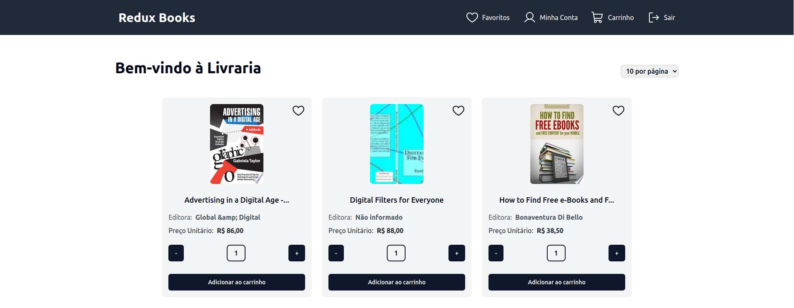

<div align="center">
<p>

</p>



[Clique aqui para visualizar o site](vs13-front-redux-books-beta.vercel.app)

</div>
***

## Índice

- [1. Prefácio](#1-prefácio)
- [2. Orientações para a Tarefa](#2-orientações-para-a-tarefa)
- [3. Metodologia](#3-metodologia)
- [4. Instruções para acessar o projeto](#4-instruções-para-acessar-o-projeto)
- [5. Tecnologias utilizadas](#5-tecnologias-utilizadas)
- [6. Desenvolvedores](#6-desenvolvedores)

---

## 1. Prefácio

Atividade desenvolvida para o programa de estágio Vem Ser da empresa DBC Company - turma 13, que tem como objetivo desenvolver as nossas habilidades com o _React_ e _Redux Toolkit_ integrando o conhecimento adquirido em aula.

---

## 2. Orientações para a Tarefa

Desenvolver uma aplicação que utilize o Redux Toolkit para fazer o gerenciamento dos estados globais.

### Requisitos da tarefa:

Criar um sistema de Livraria online onde:

- [x] Cadastro e login do usuário
- [x] Área logada
- [x] Listagem de livros com preço
- [x] Adicionar ao carrinho
- [x] Uso de Redux RTK Query
- [x] Estilização básica
- [x] Usar os métodos GET e POST
- [x] Ter área logada
- [x] _Deploy_ no _Vercel_

---

## 3. Metodologia

- Foi _codado_ em _branchs_ com nomes semânticos, sendo permitido somente abrir _pull request_ para a _branch develop_, após a tarefa conluída foi aberta a _pull request_ para a _branch main_;
- Para o código foi adotado criação de classes e _commites_ em inglês;
- Pesquisa de _Ui Design_ para escolher as paletas relacionadas ao tema de livraria;

---

## 4. Instruções para acessar o projeto

Este projeto tem como requisito o _deploy_ pelo _Vercel_, portanto pode ser visualizado [clicando aqui](vs13-front-redux-books-beta.vercel.app)

1 - Clone o projeto

```bash
git clone git@github.com:davislamenha/vs13-front-redux-books.git
```

2 - Instale as depêndencias

```bash
npm i
```

3 - Inicie o projeto

```bash
npm run dev
```

---

## 5. Tecnologias utilizadas

<div>
<br>


</div>

<br>

---

### 6. Desenvolvedores

#### Davis Sampaio <br>

[Github](https://github.com/davislamenha)

#### André Felipe Souza <br>

[Github](https://github.com/andr3felipe)
<br>

---
